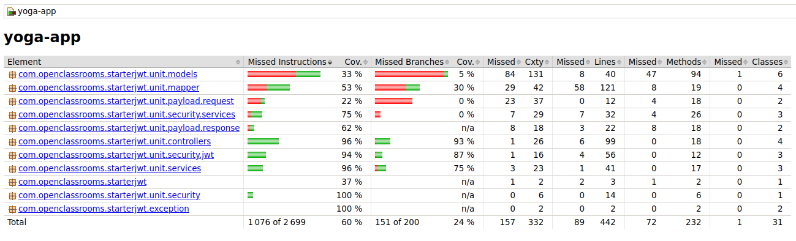
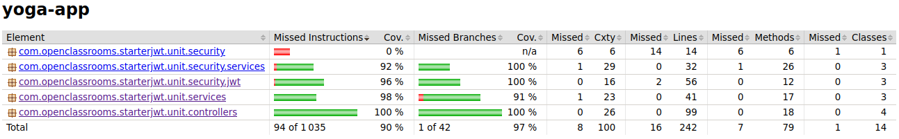
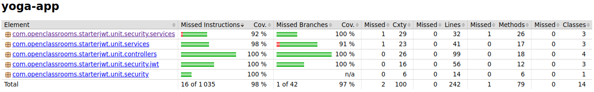
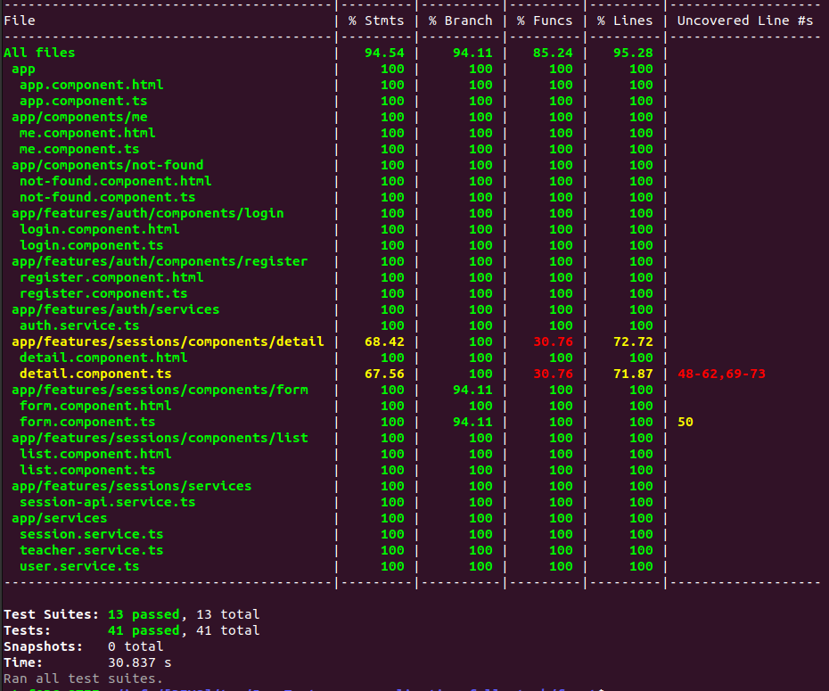
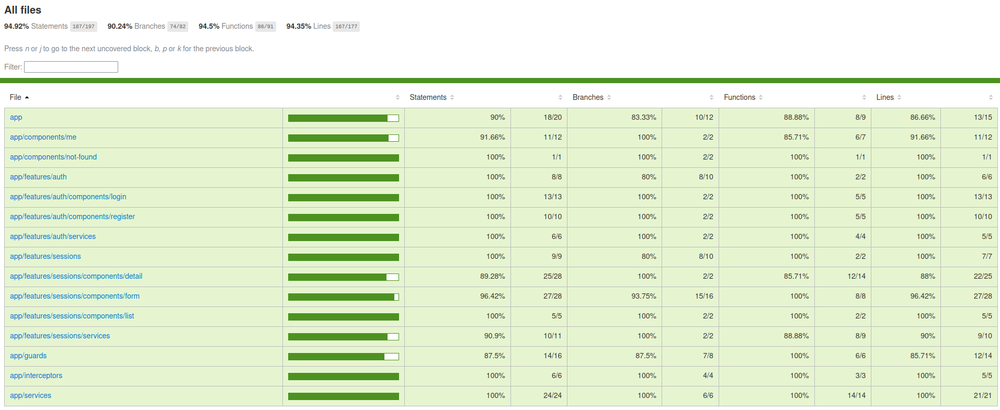

# 🚀 Projet5 - Documentation Complète

Bienvenue dans la documentation du projet **Projet5**. Ce README explique comment installer, lancer et tester l'application, ainsi que générer les rapports de couverture, le tout de manière continue.

## 🛠️ Prérequis

Avant de commencer, assurez-vous d'avoir installé sur votre machine :

- **Node.js** >= 16.x
- **npm** >= 8.x
- **Angular CLI** >= 14.x
- **TypeScript** >= 4.x
- **Jest** pour les tests unitaires
- **Cypress** pour les tests end-to-end
- **ESLint** pour l'analyse de code
- **Webpack** pour le bundling
- **Express** si vous utilisez le serveur statique intégré
- **Navigateur moderne** (Chrome, Firefox ou Edge) pour exécuter l'application et les tests E2E

Ce projet utilise principalement :
- **Angular 14** avec Material et Flex-Layout
- **RxJS** pour la gestion des flux réactifs
- **Jest + NYC + Istanbul** pour la couverture des tests front-end
- **Cypress + @cypress/code-coverage** pour les tests end-to-end et la couverture
- **ESLint et Angular ESLint** pour le linting
- **Webpack** pour la configuration personnalisée du build


## 🗄️ Installation et configuration de la base de données

Pour créer la base de données et l’utilisateur `projet5` :

```bash
mysql -u root -p -e "CREATE DATABASE projet5;"
mysql -u root -p projet5 < ressources/sql/script.sql
mysql -u root -p -e "CREATE USER 'projet5'@'%' IDENTIFIED BY 'projet5';GRANT ALL PRIVILEGES ON projet5.* TO 'projet5'@'%';FLUSH PRIVILEGES;"
```

## 💻 Installation et lancement de l’application

Installer et lancer l'application front-end et back-end :

```bash
# Installer front-end
cd front/
npm install

# Installer back-end
cd ../back/
mvn clean package -U
mvn clean install -Dmaven.test.skip=true

# Lancer front-end
cd ../front/
npm run start
# Accéder à l'application : http://localhost:4200/

# Lancer back-end
cd ../back/
mvn spring-boot:run
```

## 🧪 Lancer les tests et générer les rapports de couverture

Exécuter tous les tests et générer les rapports :

```bash
# Back-end
cd back/
mvn clean test
mvn verify
# Rapports :
# Intégration : /target/jacoco-report-it/index.html
# Unitaire : /target/jacoco-report-unit/index.html
# Commun : /target/jacoco-report-merged/index.html

# Front-end
cd ../front/
npm install
npm run test

# End-to-end (E2E)
ng build --configuration=coverage
node serve-coverage.js
npx cypress run
npx nyc report --reporter=lcov --reporter=text-summary
# Rapport E2E : /coverage/lcov-report/index.html
```

## ✅ Résultat attendu

Après avoir exécuté tous les tests, vous devriez obtenir les rapports de couverture dont voici leur aperçu :

### 🧪 Back-end - Tests d'intégration
  
Chemin : `/back/target/jacoco-report-it/index.html`

### 🧪 Back-end - Tests unitaires
  
Chemin : `/back/target/jacoco-report-unit/index.html`

### 🧪 Back-end - Rapport fusionné
  
Chemin : `/back/target/jacoco-report-merged/index.html`

### 💻 Front-end - Tests unitaires
  
Chemin : `/front/coverage/lcov-report/index.html`

### 🌐 End-to-end (E2E)
  
Chemin : `/front/coverage/lcov-report/index.html`